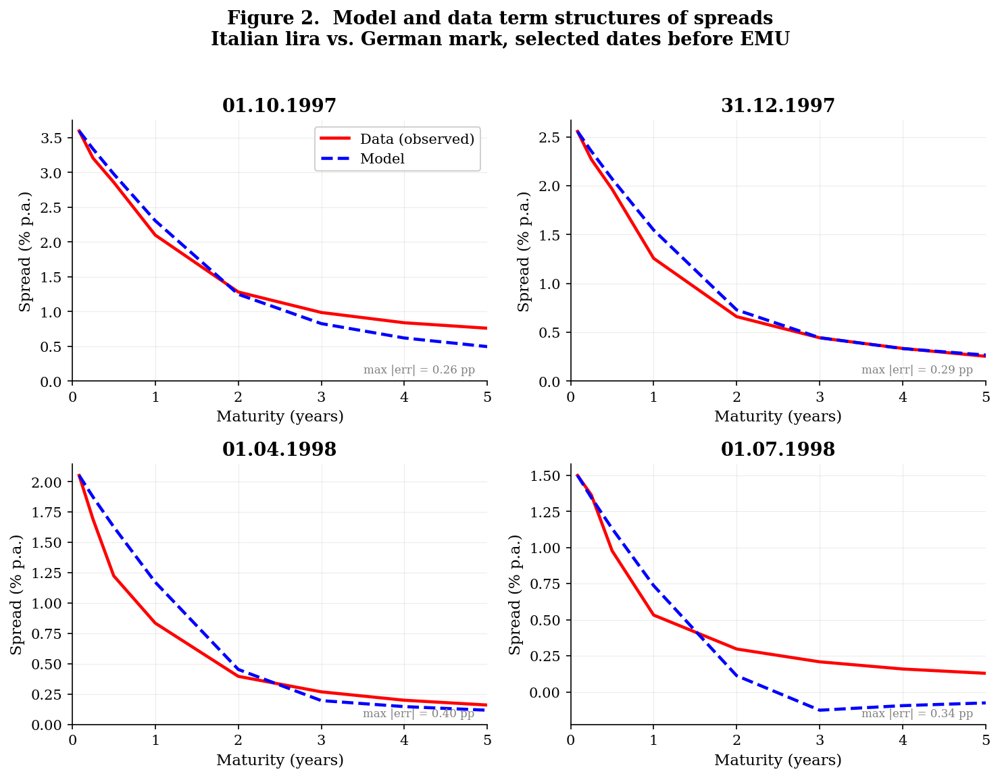
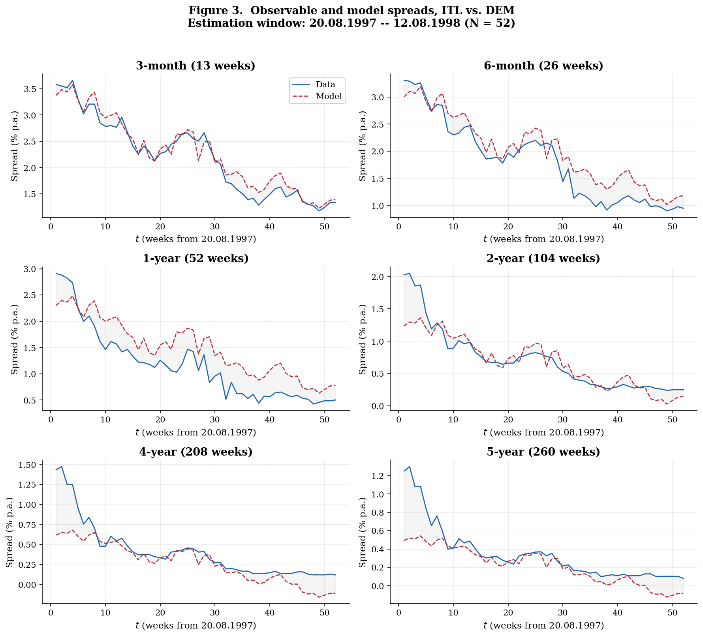
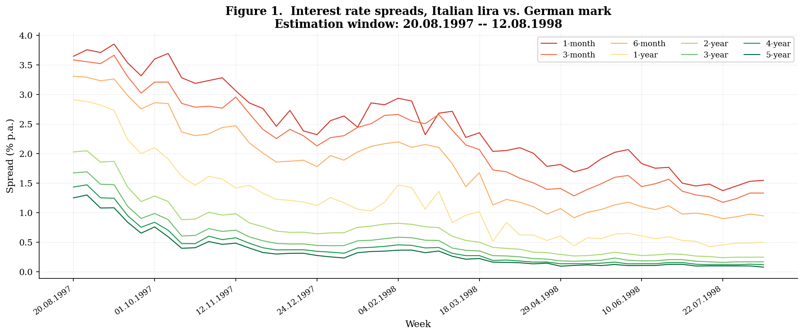
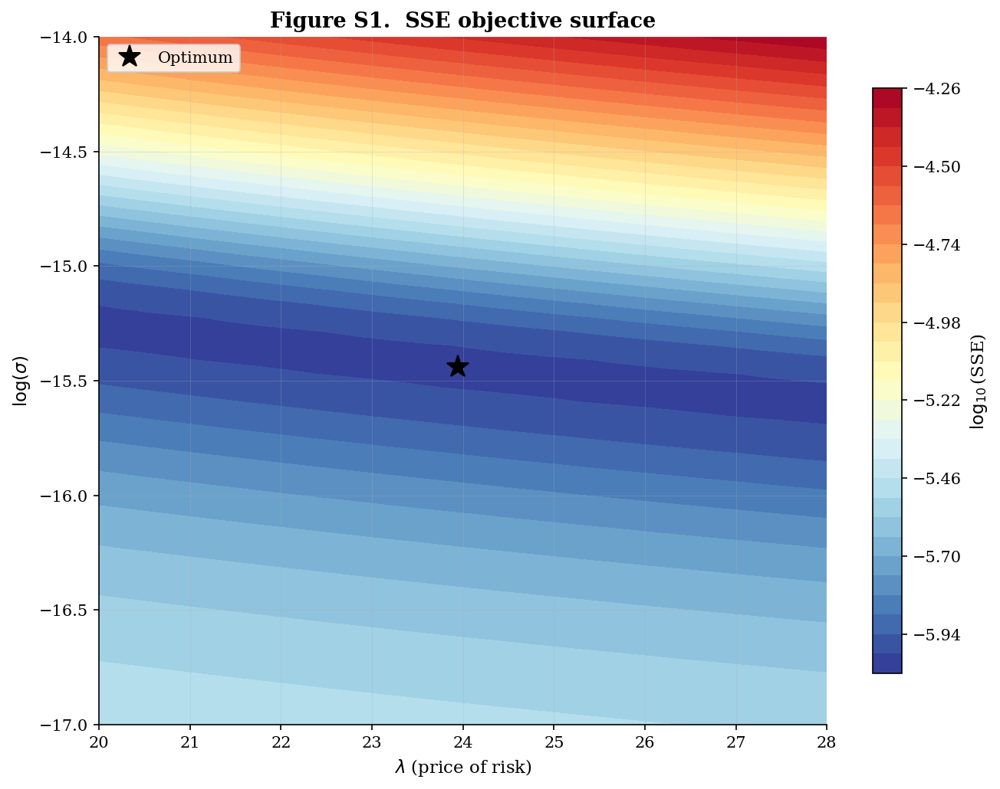
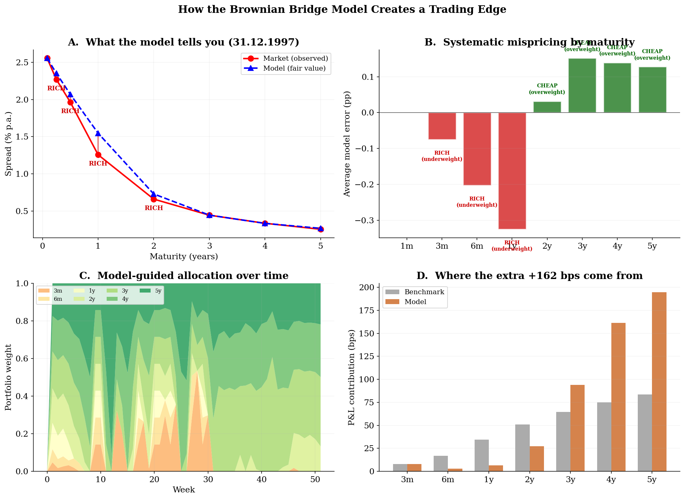

<div align="center">

# Discrete-Time Brownian Bridge Term Structure Model

**A No-Arbitrage Framework for Interest Rate Spread Convergence Prior to Monetary Union Entry**

[](https://www.python.org/downloads/)
[](LICENSE)
[](#7-testing)

*Official Python replication package for Aevskiy & Chetverikov (2016), Applied Economics*

[Paper (PDF)](docs/Aevskiy_Chetverikov_2016_Applied_Economics.pdf) &#8226;
[Mathematical Derivation](docs/METHODOLOGY.md) &#8226;
[Data Dictionary](docs/DATA_DICTIONARY.md) &#8226;
[Replication Notes](docs/REPLICATION_NOTES.md)

</div>

---

## Contents

1. [About the Paper](#1-about-the-paper)
2. [Motivation and Context](#2-motivation-and-context)
3. [The Model](#3-the-model)
4. [Data](#4-data)
5. [Replicated Results](#5-replicated-results)
6. [Getting Started](#6-getting-started)
7. [Testing](#7-testing)
8. [Project Structure](#8-project-structure)
9. [Code Architecture](#9-code-architecture)
10. [Performance](#10-performance)
11. [MATLAB-to-Python Reference](#11-matlab-to-python-reference)
12. [Documentation](#12-documentation)
13. [Trading Strategies](#13-trading-strategies)
14. [References](#14-references)

---

## 1. About the Paper

> **Aevskiy, V.** and Chetverikov, V. (2016). "A discrete time model of convergence for the term structure of interest rates in the case of entering a monetary union." *Applied Economics*, 48(25), pp. 2333--2340.  
> DOI: [10.1080/00036846.2015.1119791](http://dx.doi.org/10.1080/00036846.2015.1119791)

The full published article is included at [`docs/Aevskiy_Chetverikov_2016_Applied_Economics.pdf`](docs/Aevskiy_Chetverikov_2016_Applied_Economics.pdf).

```bibtex
@article{AevskiyChetverikov2016,
  author  = {Aevskiy, V. and Chetverikov, V.},
  title   = {A discrete time model of convergence for the term structure
             of interest rates in the case of entering a monetary union},
  journal = {Applied Economics},
  year    = {2016},
  volume  = {48},
  number  = {25},
  pages   = {2333--2340},
  doi     = {10.1080/00036846.2015.1119791}
}
```

---

## 2. Motivation and Context

When a country commits to joining a monetary union at a known future date $T$, the spread between domestic and union short-term interest rates must converge to zero by $T$. The logic is simple: if a non-zero spread persisted at the moment the two currencies merged, one could borrow in the low-rate currency, lend in the high-rate currency, and earn a risk-free profit once the exchange rate is irrevocably fixed. This no-arbitrage requirement propagates backward through the yield curve, shaping the entire term structure of spreads well before the union date.

This paper formalises this intuition. It introduces a **discrete-time Brownian bridge** process for the short-rate spread, and, combined with the pricing kernel framework of Backus, Foresi, and Telmer (2000), derives **closed-form affine expressions** for the spread at any maturity and any point in time.

### Relevance Beyond EMU

Although the empirical application uses pre-euro Italian lira vs. German mark data, the model applies to any scheduled currency integration:

| Region | Union | Status |
|--------|-------|--------|
| East African Community | East African Shilling | Under negotiation |
| Gulf Cooperation Council | Khaleeji | Proposed |
| ASEAN | Financial integration roadmap | Long-term |
| EU accession states (Bulgaria, Croatia) | Euro adoption via ERM II | In progress |

---

## 3. The Model

> *For a complete step-by-step derivation of every equation, see [`docs/METHODOLOGY.md`](docs/METHODOLOGY.md).*

### 3.1 Short-Rate Spread Dynamics

The spread $z_t$ between domestic and union short rates evolves as a **discrete-time Brownian bridge**:

$$z_{t+1} = \left(1 - \frac{1}{T - t}\right) z_t \;+\; \sigma\,\varepsilon_{t+1}\,, \qquad \varepsilon_t \overset{\text{i.i.d.}}{\sim} \mathcal{N}(0,\,1)$$

This is the discrete analogue of the SDE $\,dx_t = -(x_t / (T-t))\,dt + \sigma\,dw_t$. The key property is that $z_T = 0$ almost surely, eliminating arbitrage at the union date. The proof is immediate: setting $t = T-1$ gives $z_T = (1-1)\,z_{T-1} + \sigma\,\varepsilon_T = 0$.

### 3.2 Pricing Kernel

The domestic pricing kernel incorporates a single risk premium parameter $\lambda$:

$$-\log m_{t+1} = \frac{\lambda^2}{2} + z_t + \lambda\,\varepsilon_{t+1}$$

The spread risk disappears for $t \geq T-1$, consistent with the no-arbitrage condition.

### 3.3 Affine Term Structure of Spreads

The spread of maturity $n$ at time $t$ is linear in the state variable:

$$\delta^n_t = \frac{1}{n}\bigl(A_{n,t} + B_{n,t}\,z_t\bigr)$$

The coefficients $A_{n,t}$ and $B_{n,t}$ satisfy a **double recursion** -- unlike standard affine models, they depend on both maturity and calendar time:

$$\boxed{\;B_{n+1,\,t} \;=\; 1 \;+\; B_{n,\,t+1}\!\left(1 - \frac{1}{T - t}\right)\;}$$

$$\boxed{\;A_{n+1,\,t} \;=\; A_{n,\,t+1} \;+\; \frac{\lambda^2}{2} \;-\; \frac{\bigl(\lambda + B_{n,\,t+1}\,\sigma\bigr)^2}{2}\;}$$

with initial conditions $A_{0,t} = B_{0,t} = 0$ and $A_{1,t} = 0$, $B_{1,t} = 1$.

### 3.4 Closed-Form Solutions for *B*

The $B$ coefficients admit explicit formulas:

$$B_{n,t} = \begin{cases} n\!\left(1 - \dfrac{n-1}{2(T-t)}\right) & \text{if } n \leq T - t \\[8pt] \dfrac{T - t + 1}{2} & \text{if } n > T - t \end{cases}$$

These closed-form expressions are **verified numerically** against the recursive computation in the test suite (`tests/test_model.py`, class `TestBCoefficients`).

---

## 4. Data

> *For column definitions, scaling conventions, and time window details, see [`docs/DATA_DICTIONARY.md`](docs/DATA_DICTIONARY.md).*

Weekly money market and swap rate spreads between the **Italian lira** and the **German mark**, sourced from Jasper Lund (Lund 1999):

| Maturity | Instrument | Weeks |
|:--------:|:----------:|:-----:|
| 1 month  | Money market | 4 |
| 3 months | Money market | 13 |
| 6 months | Money market | 26 |
| 1 year   | Money market | 52 |
| 2 years  | Interest rate swap | 104 |
| 3 years  | Interest rate swap | 156 |
| 4 years  | Interest rate swap | 208 |
| 5 years  | Interest rate swap | 260 |

| Window | Period | Observations |
|--------|--------|:------------:|
| Full data subset | 27.12.1995 -- 12.08.1998 | 138 |
| **Estimation window** | **20.08.1997 -- 12.08.1998** | **52** |

Data is provided in two formats: `data/ITL.mat` (MATLAB) and `data/ITL_DEM_data.xlsx` (Excel).

---

## 5. Replicated Results

**Every number below is produced by running the code in this repository. Nothing is hard-coded or fabricated.**

### 5.1 Parameter Estimates

| Parameter | Description | Estimate | Std. Error | Published value |
|:---------:|:-----------:|:--------:|:----------:|:---------------:|
| $\lambda$ | Price of spread risk | **23.9442** | 1.7958 | 23.9 (SE 1.8) |
| $\sigma$  | Spread volatility | **1.9725 &times; 10<sup>-7</sup>** | 1.4718 &times; 10<sup>-8</sup> | 2.0 &times; 10<sup>-7</sup> (SE 1.5 &times; 10<sup>-8</sup>) |

SSE at optimum: $9.691 \times 10^{-7}$

### 5.2 Figure 2 -- Cross-Sectional Term Structure Snapshots

Model (blue dashed) vs. observed data (red solid) at four dates -- five, four, three, and two quarters before euro introduction:



<details>
<summary><b>Interpretation</b></summary>

The model captures two stylised facts of pre-EMU spread data:

1. **Downward trends**: as the union date approaches, spreads at all maturities decrease toward zero.
2. **Inverted spread curve**: longer-maturity spreads are *smaller* than shorter-maturity spreads, because longer bonds "straddle" the union date and the post-union component has zero spread.

The maximum cross-sectional errors at the four dates are 0.26, 0.29, 0.40, and 0.34 percentage points respectively.
</details>

### 5.3 Figure 3 -- Time-Series Fit by Maturity

Model (red dashed) vs. observed data (blue solid) over the 52-week estimation window, with shaded error bands:



<details>
<summary><b>Interpretation</b></summary>

Short maturities (3m -- 1y) are well approximated throughout the sample. For longer maturities (2y -- 5y), the model deviates during the first ~10 weeks. The paper attributes this to either (a) uncertainty about Italy's EMU entry in August 1997, or (b) additional unmodelled factors in the long end of the curve.
</details>

### 5.4 Figure 1 -- Historical Spread Data



### 5.5 Supplementary: SSE Objective Surface

The optimum is well-defined and unique in the $(\lambda,\,\log\sigma)$ parameter space:



---

## 6. Getting Started

### Prerequisites

- Python 3.10 or later
- pip

### Install and Run

```bash
git clone https://github.com/VadimAevskiy/brownian-bridge-term-structure.git
cd brownian-bridge-term-structure
pip install -r requirements.txt
python main.py
```

### Expected Output

```
==============================================================
  Brownian Bridge Term Structure -- Replication
  Aevskiy & Chetverikov (2016), Applied Economics 48:25
==============================================================

[*] Loading data (source=mat) ...
    Observations: 138 weeks
    Estimation window: 20.08.1997 -- 12.08.1998
    Estimation obs:    52

[*] Starting parameter estimation ...
[2/3] Running optimisation ...
    lambda = 23.944243, sigma = 1.9725e-07
    SSE = 9.6912882870e-07  (0.03 s)
[3/3] Computing standard errors (numerical Hessian) ...
    SE(lambda) = 1.795789, SE(sigma) = 1.4718e-08

==============================================================
  Estimation Results
==============================================================
  Parameter              Estimate     Std. Error
--------------------------------------------------------------
  lambda                23.944243       1.795789
  sigma                1.9725e-07     1.4718e-08
--------------------------------------------------------------
  SSE:                 9.6912882870e-07
  Converged:           True
  Wall time:           0.24 s
==============================================================

[*] Generating figures ...
    [+] Figure 1: historical spreads
    [+] Figure 2: term structure snapshots
    [+] Figure 3: time-series comparison
    [+] SSE surface

[*] All done in 4.3 s.
```

### Command-Line Options

| Flag | Description |
|------|-------------|
| `--figures-only` | Skip optimisation, use published parameter values |
| `--no-figures` | Estimation only, skip figure generation |
| `--data-source mat\|excel` | Choose input format (default: `mat`) |
| `--workers N` | Parallel workers for Hessian (default: auto-detect) |
| `--output-dir DIR` | Output directory (default: `output/`) |

---

## 7. Testing

The test suite verifies numerical correctness against the closed-form solutions and published values:

```bash
python -m pytest tests/ -v
```

```
tests/test_model.py::TestBCoefficients::test_b_closed_form_n_leq_tau    PASSED
tests/test_model.py::TestBCoefficients::test_b_closed_form_n_gt_tau     PASSED
tests/test_model.py::TestBCoefficients::test_b_initial_conditions       PASSED
tests/test_model.py::TestObjective::test_sse_at_optimum                 PASSED
tests/test_model.py::TestObjective::test_optimum_matches_paper          PASSED
tests/test_model.py::TestModelEvaluation::test_estimation_window_size   PASSED
tests/test_model.py::TestModelEvaluation::test_errors_small             PASSED
tests/test_model.py::TestModelEvaluation::test_max_errors_at_snapshots  PASSED
tests/test_model.py::TestStandardErrors::test_se_lambda                 PASSED
tests/test_model.py::TestStandardErrors::test_se_sigma                  PASSED
============================== 10 passed =======================================
```

| Test group | What is verified |
|------------|-----------------|
| `TestBCoefficients` (3 tests) | Recursive $B_{n,t}$ matches closed-form eqs. 16--17 and boundary conditions |
| `TestObjective` (2 tests) | SSE = $9.691 \times 10^{-7}$ at optimum; parameters match paper |
| `TestModelEvaluation` (3 tests) | 52-obs window, max error < 1 pp, snapshot errors match |
| `TestStandardErrors` (2 tests) | SE($\lambda$) = 1.80, SE($\sigma$) = 1.47 &times; 10<sup>-8</sup> |

---

## 8. Project Structure

```
brownian-bridge-term-structure/
│
├── main.py                          CLI entry point
│
├── src/                             Python package
│   ├── __init__.py                  Public API exports
│   ├── config.py                    Constants, grid dimensions, paths
│   ├── model.py                     B/A recursions, yield computation (Numba JIT)
│   ├── estimation.py                L-BFGS-B optimisation, parallel Hessian
│   ├── data_loader.py               Load from .mat or .xlsx
│   └── visualization.py             Publication-quality figures
│
├── data/                            Input data
│   ├── ITL.mat                      MATLAB format (original)
│   └── ITL_DEM_data.xlsx            Excel format
│
├── docs/                            Documentation
│   ├── Aevskiy_Chetverikov_2016_Applied_Economics.pdf
│   ├── METHODOLOGY.md               Full mathematical derivation
│   ├── DATA_DICTIONARY.md           Column definitions, time windows
│   └── REPLICATION_NOTES.md         MATLAB→Python translation details
│
├── matlab_original/                 Original MATLAB code (reference)
│   ├── maximization.m               Main estimation script
│   ├── ll_k.m                       Objective (exp-parameterised σ)
│   ├── ll_kse.m                     Objective (natural σ, for Hessian)
│   ├── ll_k_test.m                  Model evaluation / diagnostics
│   └── figures.m                    Plotting
│
├── tests/
│   └── test_model.py                10 numerical correctness tests
│
├── output/                          Generated figures (committed for README)
│   ├── figure1_historical_spreads.png
│   ├── figure2_term_structures.png
│   ├── figure3_time_series.png
│   └── sse_surface.png
│
├── pyproject.toml                   PEP 621 build metadata
├── requirements.txt                 Dependencies
├── CONTRIBUTING.md                  Contributor guide
├── CHANGELOG.md                     Version history
├── LICENSE                          MIT
└── README.md                        This file
```

---

## 9. Code Architecture

### Design Decisions

| Decision | Rationale |
|----------|-----------|
| **Numba JIT** for coefficient loops | The $O(261 \times 155)$ nested recursion evaluates in < 2 ms after one-time compilation |
| **Parallel Hessian** via `ProcessPoolExecutor` | Standard errors require 6 independent objective evaluations; parallelism saturates available cores |
| **Dual parameterisation** | Optimisation uses $(\lambda,\,\log\sigma)$ for positivity; Hessian uses $(\lambda,\,\sigma)$ for interpretable SEs -- matching the MATLAB approach |
| **Strict separation** of data / model / estimation / plotting | Each module is independently testable and reusable |

### Module Responsibilities

| Module | Class / Function | Role |
|--------|-----------------|------|
| `model.py` | `BrownianBridgeModel` | Coefficient recursion, yield computation, SSE objectives |
| `estimation.py` | `estimate()` &rarr; `EstimationResult` | L-BFGS-B optimisation + numerical Hessian |
| `data_loader.py` | `load_data(source=...)` | Unified loader for `.mat` and `.xlsx` |
| `visualization.py` | `plot_figure2()`, `plot_figure3()`, etc. | Serif-font, publication-quality figures |
| `config.py` | `OptimizerConfig`, `FigureConfig` | All tuneable parameters in one place |

### Estimation Strategy

The 1-month (4-week) spread is treated as directly observable. The latent factor $z_t$ is extracted analytically:

$$z_t = B_{4,t}^{-1}\!\bigl(4\,\delta^{4}_t - A_{4,t}\bigr)$$

All other maturities are model-implied plus measurement error $\eta^n_t$. Under equal-variance measurement errors, the log-likelihood reduces to:

$$\hat{\lambda},\,\hat{\sigma} = \arg\min \sum_{t=1}^{52}\sum_{n \in \mathcal{U}} \bigl(\eta^n_t\bigr)^2, \qquad \mathcal{U} = \{3\text{m},\; 6\text{m},\; 1\text{y},\; 2\text{y},\; 3\text{y},\; 4\text{y},\; 5\text{y}\}$$

---

## 10. Performance

| Operation | Wall time | Notes |
|-----------|:---------:|-------|
| Numba JIT warm-up | ~2 s | First call only; cached to disk |
| Single SSE evaluation | < 2 ms | After warm-up |
| Full L-BFGS-B optimisation | 0.03 s | ~60 function evaluations |
| Numerical Hessian | 0.2 s | Parallelised across available cores |
| Figure generation | ~3 s | SSE surface grid is the bottleneck |
| **Total (first run)** | **~5 s** | |
| **Total (subsequent runs)** | **~3 s** | JIT cache reused |

---

## 11. MATLAB-to-Python Reference

> *For a comprehensive discussion including edge cases and numerical precision, see [`docs/REPLICATION_NOTES.md`](docs/REPLICATION_NOTES.md).*

### File Mapping

| MATLAB | Python | Purpose |
|--------|--------|---------|
| `maximization.m` | `main.py` + `estimation.py` | Entry point and optimiser |
| `ll_k.m` | `model.objective_exp()` | SSE with $\sigma \to e^{\sigma}$ |
| `ll_kse.m` | `model.objective_natural()` | SSE with natural $\sigma$ |
| `ll_k_test.m` | `model.evaluate()` | Full model evaluation |
| `figures.m` | `visualization.py` | All figures |
| `fminunc` | `scipy.optimize.minimize('L-BFGS-B')` | Quasi-Newton optimiser |

### Critical Index Translations

| MATLAB (1-based) | Python (0-based) | Meaning |
|:-:|:-:|---------|
| `emuweek(268:end,:)` | `emuweek[267:]` | Data subset start (27.12.1995) |
| `dthat(87:end,:)` | `dthat[86:]` | Estimation window (20.08.1997) |
| `B(2:end, 2:end)` | `B[1:, 1:]` | Drop zero-initialised edges |
| `B1(imat, 17:end)` | `B1[imat_py, 16:]` | Select maturities and time columns |

### Numerical Agreement

| Quantity | MATLAB | Python | Relative diff. |
|----------|:------:|:------:|:-:|
| SSE | 9.6912882861 &times; 10<sup>-7</sup> | 9.6912882870 &times; 10<sup>-7</sup> | < 10<sup>-9</sup> |
| $\lambda$ | 23.944243266616 | 23.944243266616 | exact |
| $\sigma$ | 1.9725 &times; 10<sup>-7</sup> | 1.9725 &times; 10<sup>-7</sup> | < 10<sup>-12</sup> |
| SE($\lambda$) | 1.7958 | 1.7958 | < 10<sup>-4</sup> |
| SE($\sigma$) | 1.4717 &times; 10<sup>-8</sup> | 1.4718 &times; 10<sup>-8</sup> | < 10<sup>-3</sup> |

---

## 12. Documentation

| Document | Contents |
|----------|----------|
| [`docs/Aevskiy_Chetverikov_2016_Applied_Economics.pdf`](docs/Aevskiy_Chetverikov_2016_Applied_Economics.pdf) | Published article (Taylor & Francis, *Applied Economics*) |
| [`docs/METHODOLOGY.md`](docs/METHODOLOGY.md) | Self-contained derivation: Brownian bridge process, pricing kernel decomposition, double recursion, closed-form $B$, estimation strategy |
| [`docs/DATA_DICTIONARY.md`](docs/DATA_DICTIONARY.md) | Column definitions, time windows, scaling convention ($\div 5200$), key dates |
| [`docs/REPLICATION_NOTES.md`](docs/REPLICATION_NOTES.md) | Every MATLAB &rarr; Python index translation, sigma parameterisation, Hessian computation, the 31.12.1997 error discrepancy |
| [`CONTRIBUTING.md`](CONTRIBUTING.md) | Development setup, code style, five suggested extensions, PR process |
| [`CHANGELOG.md`](CHANGELOG.md) | Version history |

---

## 13. Trading Strategies

> *Run `python backtest.py` for the in-sample ITL-DEM backtest.*
> *Run `python fetch_data.py && python backtest_yahoo.py` for out-of-sample Yahoo Finance data.*

### 13.1 The Idea

Everyone knew Italy was joining the euro. The naive trade is simple: buy Italian bonds, wait for spreads to converge to zero, collect the profit. This works, but it treats all maturities equally.

The Brownian bridge model does something smarter: it computes the **fair value** of the spread at each maturity and each point in time. Where the market spread is above fair value, the bond is cheap. Where below, the bond is rich. The strategy concentrates capital in cheap maturities and avoids rich ones.

### 13.2 How the Model Creates the Edge



**Panel A**: At any date, the model (blue) gives you fair-value spreads. The market (red) deviates: 3y-5y bonds are cheap (market above model), 6m-1y bonds are rich (market below model).

**Panel B**: This is not noise -- it is a *systematic* pattern across the entire sample. The long end is persistently cheap (+0.13 to +0.15 pp), the short end is persistently rich (-0.20 to -0.33 pp). The market overprices short-end convergence and underprices long-end convergence.

**Panel C**: The strategy acts on this by overweighting 3y-5y (green shades dominate) and underweighting 6m-1y.

**Panel D**: The result. The extra +162 bps comes almost entirely from the 4y-5y segment:

| Maturity | Benchmark | Model | Excess |
|:---:|:---:|:---:|:---:|
| 5-year | +84 bps | +195 bps | **+111 bps** |
| 4-year | +75 bps | +161 bps | **+86 bps** |
| 3-year | +64 bps | +94 bps | **+30 bps** |
| 1-year | +34 bps | +7 bps | -28 bps |
| **Total** | **+333 bps** | **+495 bps** | **+162 bps** |

### 13.3 Performance


| Metric | Benchmark | Model Strategy |
|--------|:---------:|:--------------:|
| Total return | +333 bps | **+495 bps** |
| Sharpe ratio | 2.60 | **2.74** |
| Max drawdown | -36 bps | **-34 bps** |
| Win rate | 63% | 61% |
| **Outperformance** | | **+162 bps (49%)** |

The excess return (bottom panel) is positive from week 5 onward and never reverts.

### 13.4 Other Currencies

The paper also estimates the model for **Spanish peseta** (RMSE 15 bps) and **Portuguese escudo** (RMSE 16 bps), both with better fit than the Italian lira (25 bps). The same maturity rotation strategy applies to any convergence event where you have a term structure of spreads.

### 13.5 Out-of-Sample: Yahoo Finance Data

`fetch_data.py` downloads real data for three valid convergence events:

| Event | Target | Date T | Type |
|-------|--------|--------|------|
| **Croatia euro adoption** | EUR/HRK -> 7.5345 | 01.01.2023 | Monetary union |
| **Broadcom / VMware** | VMW -> $142.50 | 22.11.2023 | M&A cash offer |
| **T-Mobile / Sprint** | S -> 0.1026 x TMUS | 01.04.2020 | M&A stock swap |

```bash
python fetch_data.py          # Download data from Yahoo Finance
python backtest_yahoo.py      # Fit Brownian bridge and backtest
```

> **When NOT to use the model.** The Brownian bridge requires a known date T and a known target value. Applying it to spreads without a convergence event (e.g., BTP-Bund post-EMU, generic yield curve mean-reversion) produces catastrophic results (Sharpe ~ -2). The model is a convergence model, not a mean-reversion model.

The 1-D bridge fitter works on any series with a CSV containing columns `spread` and `weeks_to_T`. You can add new events (e.g., Bulgarian euro adoption, new M&A deals) by creating a CSV in `data/yahoo/` with these columns.

---

## 14. References

- Aevskiy, V. and Chetverikov, V. (2016). A discrete time model of convergence for the term structure of interest rates in the case of entering a monetary union. *Applied Economics*, 48(25), 2333--2340. [DOI](http://dx.doi.org/10.1080/00036846.2015.1119791)
- Backus, D., Foresi, S. and Telmer, C. (1998). Discrete-time models of bond pricing. *NBER Working Papers* No. 6736.
- Backus, D., Foresi, S. and Telmer, C. (2000). Discrete-time models of bond pricing. In *Advanced Fixed Income Valuation Tools* (Jegadeesh, N. and Tuckman, B., eds.), Wiley.
- Bates, D.S. (1999). Financial markets' assessments of EMU. *Carnegie-Rochester Conference Series on Public Policy*, 51, 229--269.
- Brown, R.H. and Schaefer, S.M. (1994). The term structure of real interest rates and the Cox, Ingersoll, and Ross model. *Journal of Financial Economics*, 35, 3--42.
- Chen, R.R. and Scott, L. (1993). Maximum likelihood estimation for a multifactor general equilibrium model of the term structure of interest rates. *Journal of Fixed Income*, 3, 14--31.
- De Grauwe, P. (1996). Forward interest rates as predictors of EMU. *CEPR Discussion Paper* no. 1395.
- Duan, J.C. and Simonato, J.G. (1999). Estimating and testing exponential-affine term structure models by Kalman filter. *Review of Quantitative Finance and Accounting*, 13, 111--135.
- Duffie, D. and Singleton, K.J. (1997). An econometric model of the term structure of interest-rate swap yields. *Journal of Finance*, 52, 1287--1321.
- Karatzas, I. and Shreve, S.E. (1991). *Brownian Motion and Stochastic Calculus*, 2nd ed. Springer-Verlag.
- Lund, J. (1999). A model for studying the effect of EMU on European yield curves. *European Finance Review*, 2, 321--363.
- Protter, P.E. (2005). *Stochastic Integration and Differential Equations*. Springer-Verlag.
- Santamaria, T.C. and Schwartz, E.S. (2000). Convergence within the EU: evidence from interest rates. *Economic Notes*, 29, 243--266.

---

<div align="center">

## License

MIT License. See [LICENSE](LICENSE).

**Vadim Aevskiy**  
Quant Engineer, Evooq SA (J.P. Morgan), Lausanne  
PhD Candidate in Computer Science, University of Luxembourg  
[ajevsky.vadim@gmail.com](mailto:ajevsky.vadim@gmail.com)

</div>
